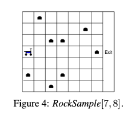

You start at the scooter position shown in the image below. The agent knows its position and the position of the rocks, but it does not know the "goodness" of the rocks (imagine some are diamonds and some are quartz, for instance). Determining the goodness of the rock is expensive, so the rover has a long-range sensor which can try to figure out how good the rock is from far away. The agent has k + 5 actions: north, south, east, west, sample, and then a check for each one of the k rocks. If the rover is directly on top of a rock, it can sample it. If the rock is deemed "good", it will receive a reward of +10 and the rock becomes bad. If the rock is deemed "bad", the agent receives a reward of -10. Moving to the exit area yields a reward of 10, and all other actions yield reward of 0. For each check action, the sensor returns its reading of the rock. At further distances, there is more noise in the sensor, so the reading will be less accurate. At worst accuracy, the sensor will have a 50/50 guess of thinking the rock is either good or bad. At the beginning of the episode, we believe every rock to have equal proability good and bad.  The episode ends when the rover crosses the exit line.

RockSample[n, k] is the Rock sample environment with an n x n grid and k rocks. 

citation: Original Paper is Smith & Simmons, Heuristic Search Value Iteration for POMDPs, 2004, https://arxiv.org/ftp/arxiv/papers/1207/1207.4166.pdf
